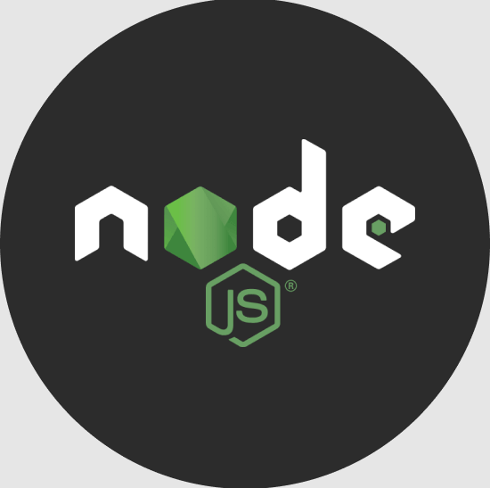
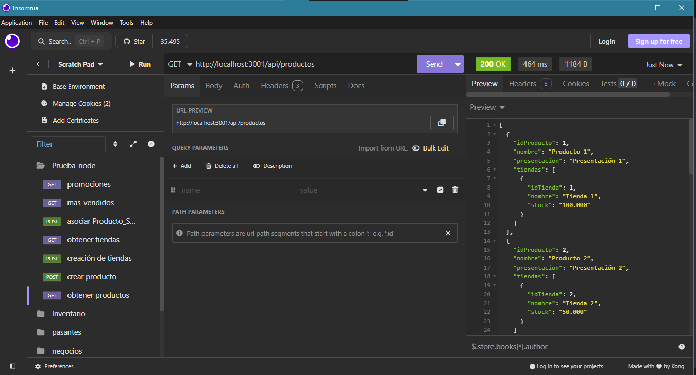
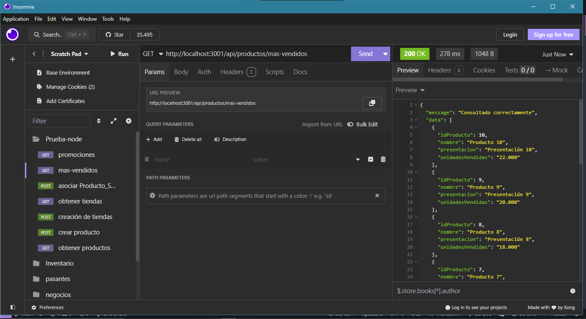
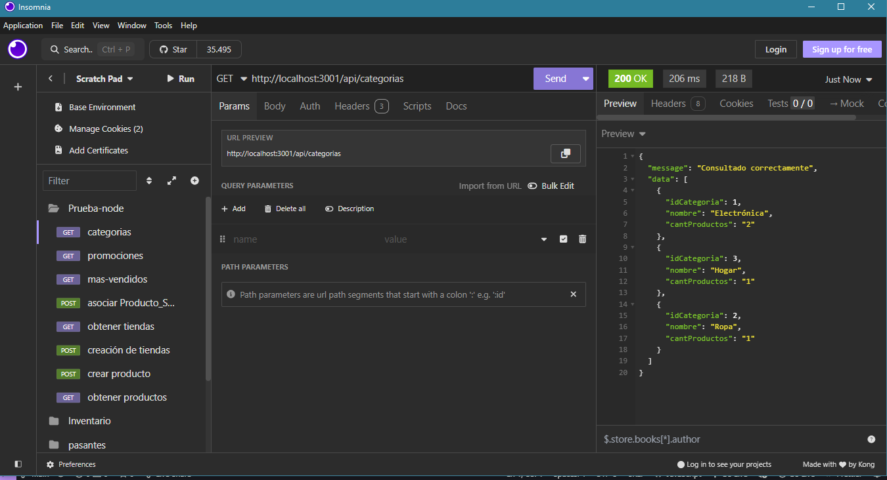
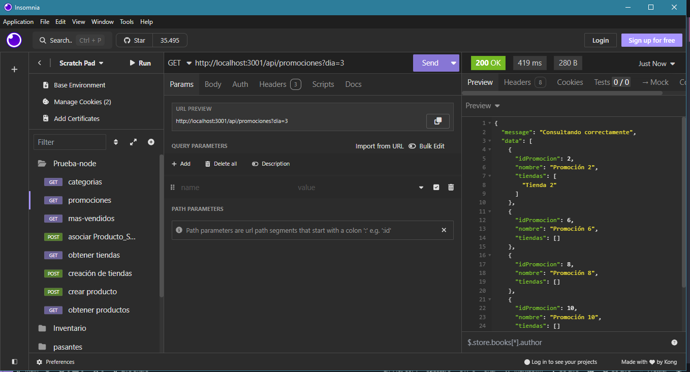

# Ricardo Rico Prueba Node


Este proyecto es una API  desarrollada en Node.js con Express y Sequelize, conectada a una base de datos PostgreSQL. La API permite gestionar productos, categorías, promociones y pedidos, entre otras funcionalidades.

## Requisitos Previos

Antes de comenzar, asegúrate de tener instalado lo siguiente:

- [Node.js](https://nodejs.org/) (v16 o superior)
- [PostgreSQL](https://www.postgresql.org/) (v12 o superior)
- [Git](https://git-scm.com/) (para clonar el repositorio)
- [Insomnia](https://insomnia.rest/) o [Postman](https://www.postman.com/) (para probar los endpoints)

## Pasos para Configurar el Proyecto

### 1. Clonar el Repositorio

Primero, clona el repositorio desde GitHub:

```bash
git clone https://github.com/rricozdev/Ricardo-Rico-prueba-node.git
```

Luego, ingresa a la carpeta del proyecto:

```bash
cd Ricardo-Rico-prueba-node/api
```

### 2. Instalar Dependencias

Instala las dependencias necesarias ejecutando:

```bash
npm install
```

### 3. Configurar la Base de Datos

1. **Crear la Base de Datos en PostgreSQL:**
   - Abre PostgreSQL y crea una base de datos llamada `market`.

2. **Configurar las Variables de Entorno:**
   - Crea un archivo `.env` en la raíz de la carpeta `api` y agrega las siguientes variables:

     ```env
     DB_USER=tu_usuario_postgres
     DB_PASSWORD=tu_contraseña_postgres
     DB_NAME=market
     DB_HOST=localhost:3001
     DB_DIALECT=postgres
     ```

   - Reemplaza `tu_usuario_postgres` y `tu_contraseña_postgres` con tus credenciales de PostgreSQL.

### 4. Levantar el Servidor

Una vez configurado el entorno, levanta el servidor ejecutando:

```bash
npm start
```

El servidor se levantará en `http://localhost:3001`, y verás un mensaje en la consola similar a este:

```
Products already exist in the database. Skipping seeding
Producto_Categoria already exist in the database. Skipping seeding
Pedidos already exist in the database. Skipping seeding
Pedido_Productos already exist in the database. Skipping seeding
Producto_Stocks already exist in the database. Skipping seeding
Promociones already exist in the database. Skipping seeding
Tienda_Promociones already exist in the database. Skipping seeding
Server listening on http://localhost:3001
```

Esto indica que el servidor está funcionando correctamente y que la base de datos ya tiene datos sembrados.

---

## Endpoints Disponibles

A continuación, se describen los endpoints disponibles en la API:

### 1. **Obtener Todos los Productos**
- **Método:** GET
- **URL:** `/api/productos`
- **Descripción:** Retorna una lista de todos los productos disponibles.



### 2. **Obtener los Productos Más Vendidos**
- **Método:** GET
- **URL:** `/api/productos/mas-vendidos`
- **Descripción:** Retorna una lista de los productos más vendidos.



### 3. **Obtener Todas las Categorías**
- **Método:** GET
- **URL:** `/api/categorias`
- **Descripción:** Retorna una lista de todas las categorías disponibles.



### 4. **Obtener Todas las Promociones**
- **Método:** GET
- **URL:** `/api/promociones`
- **Descripción:** Retorna una lista de todas las promociones activas.



---


## Pruebas con Insomnia

Puedes probar los endpoints utilizando [Insomnia](https://insomnia.rest/). Aquí te dejamos un ejemplo de cómo hacerlo:

1. **Importar la Colección:**
   - Descarga el archivo de colección de Insomnia desde el repositorio (si está disponible).
   - Importa la colección en Insomnia.

2. **Probar los Endpoints:**
   - Selecciona el endpoint que deseas probar.
   - Haz clic en "Send" para enviar la solicitud y ver la respuesta.

---

## Estructura del Proyecto

El proyecto está organizado de la siguiente manera:

```
api/
├── config/             # Configuración de la base de datos y entorno
├── migrations/         # Migraciones para crear/modificar tablas en la base de datos
├── models/             # Modelos de Sequelize (representación de las tablas de la base de datos)
├── node_modules/       # Dependencias instaladas por npm
├── seeders/            # Datos de prueba para sembrar la base de datos
├── src/                # Código fuente de la aplicación (controladores, rutas, servicios, etc.)
│   ├── controllers/    # Controladores para manejar las solicitudes HTTP
│   ├── handlers/       # Manejadores de lógica específica (opcional)
│   ├── middlewares/    # Middlewares para autenticación, validación, etc.
│   ├── models/         # Modelos de Sequelize (opcional, si se usa una carpeta separada)
│   ├── routes/         # Definición de las rutas de la API
│   ├── seeds/          # Datos de prueba para sembrar la base de datos (opcional)
│   ├── app.js          # Configuración de Express y middlewares
│   └── db.js           # Configuración de la conexión a la base de datos
├── .env                # Variables de entorno (credenciales, configuraciones sensibles)
├── .gitignore          # Archivos y carpetas ignorados por Git
├── index.js            # Punto de entrada de la aplicación
├── package-lock.json   # Versiones exactas de las dependencias instaladas
├── package.json        # Dependencias y scripts del proyecto
└── images/             # Imágenes relacionadas con el proyecto (opcional)
```

---


Este README proporciona una guía clara para configurar y utilizar el proyecto. Si necesitas ajustar algo más, no dudes en decírmelo. 😊

@byprogramador5781