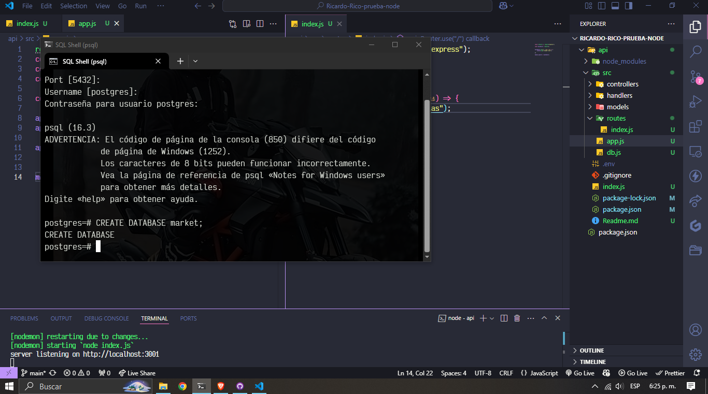

# Ricardo-Rico-Prueba-Node

## Configuración del entorno

Sigue estos pasos para configurar el entorno de desarrollo:

1. **Clona el repositorio**:
   ```bash
   git clone https://github.com/rricozdev/Ricardo-Rico-prueba-node.git
   
   cd Ricardo-Rico-prueba-node.git
   ```


## Creando la base de datos
